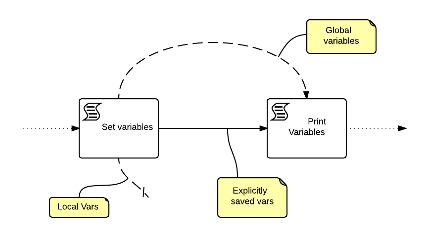

# The Dark Side of Scripting in Java and it's repercussions in Activiti
- - - 
Such a long title, it seems a PHD thesis title... also note that the post is actually double...

<pre><code>

create user test with password 'test';

createdb domain_example -O test

createdb activiti_example -O test

</code></pre>

But let's start in due order. This week, i have the honour to present a project
that actually started as a small demo for a feature in java scripting languages in interaction with Activiti
BPM framework, but has grown to be nearly a scaffold for some sort of product. This project features:

-- Spring web mvc as base (as i usually do)
-- Tiles3 (via spring views loader)
-- Hibernate as JPA provider, and Spring data-jpa, managing a bit of domain classes
-- Activiti BPM framework, with a super simple html form renderer
-- Css by BluePrint project

This will be very usefull for copy and paste!

## The Root of all evil 
- - -
Needless to say, the root of all evil is Java. And its interaction with other languages...
At the heart of the issue there is the concept of "scope" and how this concept is interpreted in
different languages. Scripting in jvm is [fun](http://www.endeios.io/blog/-/blogs/one-thousands-way-to-say-i-java-y-1), but one has to mind what
one is doing, for example, in java we don't have those _pesky_ **global variables**... 
So let's talk about a special scope, the so called "global scope". First a round of examples.

###Groovy-ing
- - -
Let's start with activiti's favourite language, and in this example we see a small twist: if we try to execute the following

<pre><code language="groovy">

some_var = "some value"
def some\_other\_var = "some other value"
def myFunction(param){
	println("Hey $param, i have $some_var")
	println("I also have $some\_other\_var")
}

myClosure = {
	param->
	println("Hey $param, i have $some_var")
	println("I also have $some\_other\_var")
}

param = "User"

myClosure(param)
println("=================")
myFunction(param)
 
</code></pre>                

we will get the following output

<pre>

Hey User, i have some value
I also have some other value
=================
Hey User, i have some value
Exception thrown

groovy.lang.MissingPropertyException: No such property: some\_other\_var for class: example1

	at example1.myFunction(example1.groovy:6)

	at example1$myFunction.callCurrent(Unknown Source)

	at example1.run(example1.groovy:19)

</pre>

So the **some_var variable is scoped global** and is seen by both the logic of the function and the closure,
and the **some\_other\_var is scoped local to the caller scope**, so the method can not see it. Usual _C/C++_ scoping here, nothing really new.. 

###Javascripting
- - -
As we all know, javascript is LISP disguised and secretly conquering the interwebs,
and of course has different [scoping](http://toddmotto.com/everything-you-wanted-to-know-about-javascript-scope/)

<pre><code language="javascript">

some_var = "some value"
var some\_other\_var = "some other value"
function myFunction(param){
	print("Hey "+param+", i have "+some_var)
	print("I also have "+some\_other\_var)
}

//joking, no such thing as difference in functions and closures in javascript....
// it is just to show parallelism
var myClosure = function(param){
	print("Hey "+param+", i have "+some_var)
	print("I also have "+some\_other\_var)
}

param = "User"

myClosure(param)
print("=================")
myFunction(param)

</code></pre> 

Here, **the functions** (which both are) **can perfectly see both variables **, because _javascript's functions are closures_, which of course is awsome.
But not that awsome, in fact if we modify in the following way

<pre><code language="javascript">
some_var = "some value"

param = "User"

function main(){
	var some_other_var = "some other value"
	myClosure(param)
	print("=================")
	myFunction(param)	
}

function myFunction(param){
	print("Hey "+param+", i have "+some_var)
	print("I also have "+some\_other\_var)
}

//joking, no such thing as difference in functions and closures in javascript....
// it is just to show parallelism
var myClosure = function(param){
	print("Hey "+param+", i have "+some_var)
	print("I also have "+some\_other\_var)
}

main()

</code></pre>

both functions cannot see the *some_other_value* value because **javascript's closure can see only the statically defined precedent scope. This is called "lexical" scope**

### Jamming with JRuby
---

In [ruby](http://www.sitepoint.com/closures-ruby/) closures are everywhere, but scoping is again different
let's see the example 

<pre><code language="ruby">
$some_var = "some value"
some_other_var = "some other value"

def myFunction(param) 
	print("Hey "+param+", i have "+$some_var+"\n")
	print("I also have "+some_other_var+"\n")
end

myClosure = Proc.new { |param|
	print("Hey "+param+", i have "+$some_var+"\n")
	print("I also have "+some_other_var+"\n")
}

param = "User"

myClosure.call(param)
print("=================")
myFunction(param)

</code></pre>

This code breaks,complaining that  the variable *some_other_variable* is not visible, exactly like groovy
(example2.rb's main function does not even find the closure, one should make a Module ecc, but thats another story)

## Every cockroach is beautiful to her mother (italian proverb)

And every scope / syntax is right for its language: the point here was to show how different jvm-script languages support global variables and how the evaluation 
affects the global binding scope (printed for your convenience by the runScript script) have. 

## A small change for activiti a big change for me

Now the matter I wrote this app for: variables' scope in Activiti's scripted service task: 
**when you put a global var, every script can see it, when it is local, it is not visible and not persisted in the historical state**
Very intuitive, if you put it in this way though i got confused at first. This because **groovy's var defined without <code>def</code> keyword
are actually set as property in the target class by the script environment**
(NOTE: (the script task)[http://www.activiti.org/userguide/index.html#bpmnScriptTask] changed in **activiti 5.12**
and you need to manually put <code>activiti:autoStoreVariables="true"</code> in xml, using a sed script)
In the example script we have the following script, one after the other:

<pre><code language="groovy">
global_variable = "i am a global variable"

def local_variable = "i am a local variable"
</code></pre>

and the successor in the graph

<pre><code language="groovy">
@Grab('log4j:log4j:1.2.17')

import org.apache.log4j.*
import groovy.util.logging.*

log = Logger.getLogger(this.class.name)
log.level=Level.DEBUG
try{
    log.info(local_variable)
    }
    catch(groovy.lang.MissingPropertyException ex){
    log.info(ex)
    }
log.info("global_variable:${global_variable}")
</code></pre>

Of course, the local variable does not make it to the second script, because what actually happens is this:

All in all it was a good excuse to write e full fledged app to test my activiti's scripts

Keep in mind that the app is still growing, and will become a sort of small _document
processing system_, in one of the next posts.

##Links

-- i have stolen templates from (here)[http://www.techzoo.org/spring-framework/spring-mvc-tiles-3-integration-tutorial.html]

## Short description
Declaring a var or not declaring a var? This is the problem!
Or the solution one might say. Point is Activiti
bases itself on the standard java' scripting engine
and the visibility of the vars, at least for me, is not a small matter

